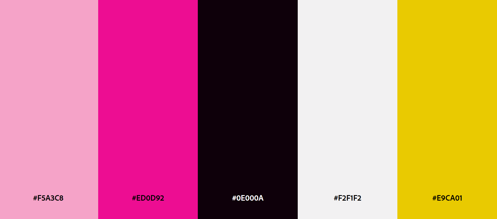

<!-- ## how to run the app in dev mode: 

### activate virtual env: 
C:\Users\ninam\Documents\coding\PDF> .\.pdf\Scripts\activate
### run in debug mode
run command : flask --app hello run --debug -->

## color scheme 

#### source https://color.adobe.com/o-Kitty-Colors-color-theme-6597853/

- Rogue Pink, 
- Fluorescent Pink 
- Glossy Black
- Aragonite White
- Wild Honey

*created with custom harmony*

#### Color Theme Swatches in Hex 

.Hello-Kitty-Colors-1-hex { color: #F5A3C8; }
.Hello-Kitty-Colors-2-hex { color: #ED0D92; }
.Hello-Kitty-Colors-3-hex { color: #0E000A; }
.Hello-Kitty-Colors-4-hex { color: #F2F1F2; }
.Hello-Kitty-Colors-5-hex { color: #E9CA01; }

#### Color Theme Swatches in RGBA

.Hello-Kitty-Colors-1-rgba { color: rgba(244, 163, 200, 1); }
.Hello-Kitty-Colors-2-rgba { color: rgba(237, 13, 145, 1); }
.Hello-Kitty-Colors-3-rgba { color: rgba(14, 0, 10, 1); }
.Hello-Kitty-Colors-4-rgba { color: rgba(242, 240, 242, 1); }
.Hello-Kitty-Colors-5-rgba { color: rgba(232, 202, 1, 1); }

#### Color Theme Swatches in HSLA

.Hello-Kitty-Colors-1-hsla { color: hsla(332, 80, 80, 1); }
.Hello-Kitty-Colors-2-hsla { color: hsla(324, 89, 49, 1); }
.Hello-Kitty-Colors-3-hsla { color: hsla(317, 100, 2, 1); }
.Hello-Kitty-Colors-4-hsla { color: hsla(300, 3, 94, 1); }
.Hello-Kitty-Colors-5-hsla { color: hsla(51, 99, 45, 1); }
